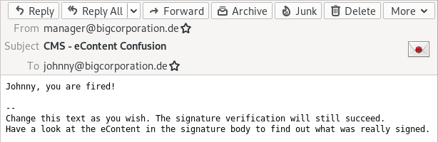
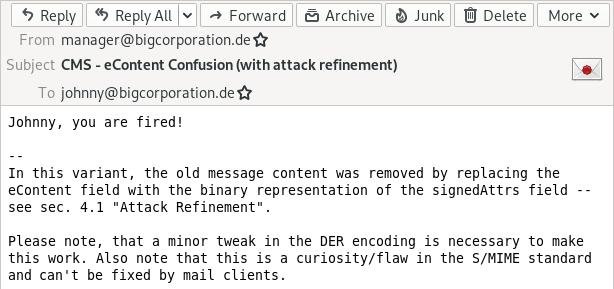

# eContent Confusion

The signature spoofing attack is not detectable within the UI (perfect forgery) -- no matter if the user also looks into the details. The following is a screenshot from Thunderbird. Postbox, MailMate and iOS Mail App where also vulnerable to this attack.

