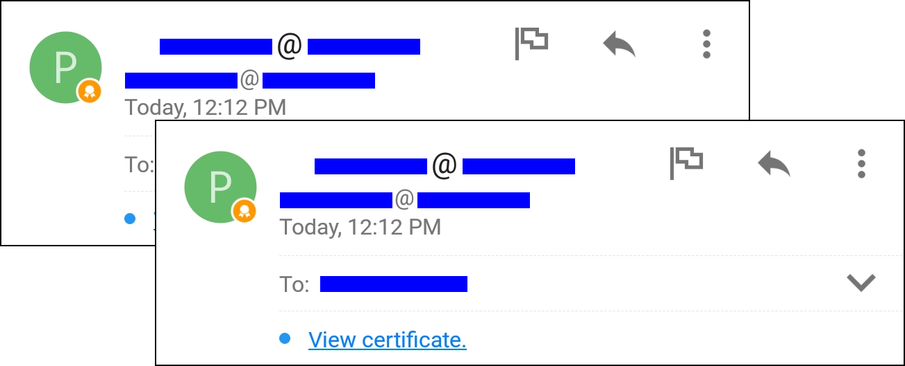
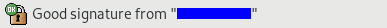
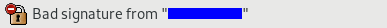
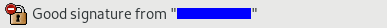

# Trust issues

### Nine

Nine does not show the validity of the certificate chain in the email view.

Thus, self-signed certificates appear exactly as valid certificates
(including all security indicators).
This makes signature spoofing trivially easy. Clicking through the UI reveals bad certificates, but we
do not consider this a sane workflow.

One of the following messages was created using a self-signed certificate.

### Claws

Claws has two security indicators: a small icon to show issues with the certificate chain and a text stating what the outcome of the signature verification, i.e. the RSA verification, was.

This is a valid message (correct trust chain, correct signature)...

a broken/spoofed message (correct trust chain, bad signature)...

and a "somewhat bad" message (self-signed certificate, good signature)...

Arguably, this UI can only be interpreted by technically versed users.
