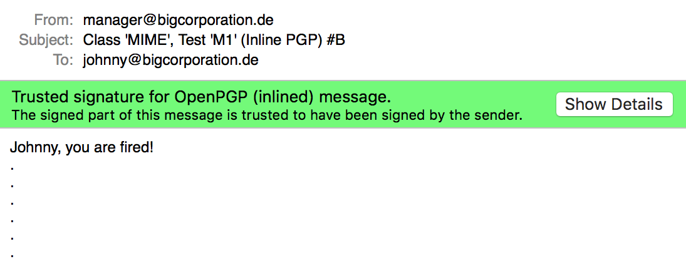
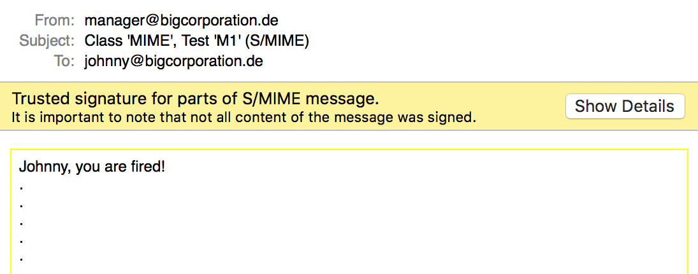
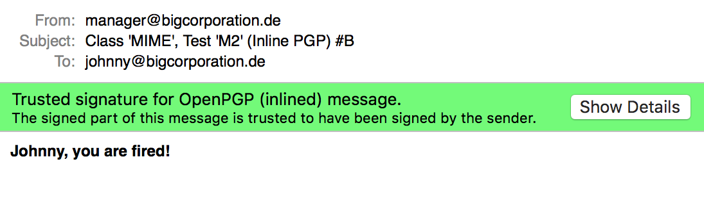
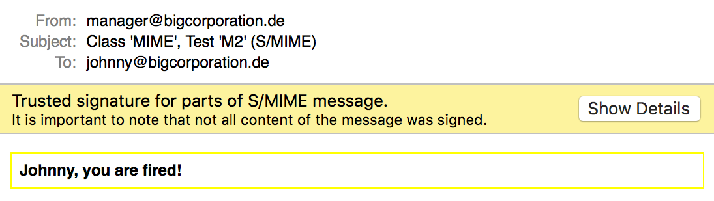
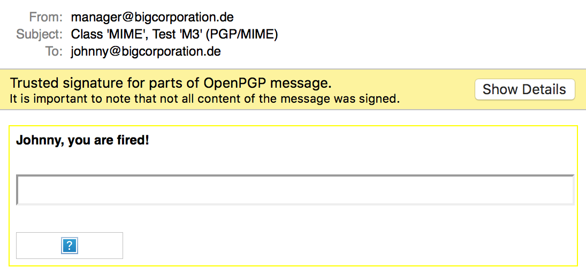
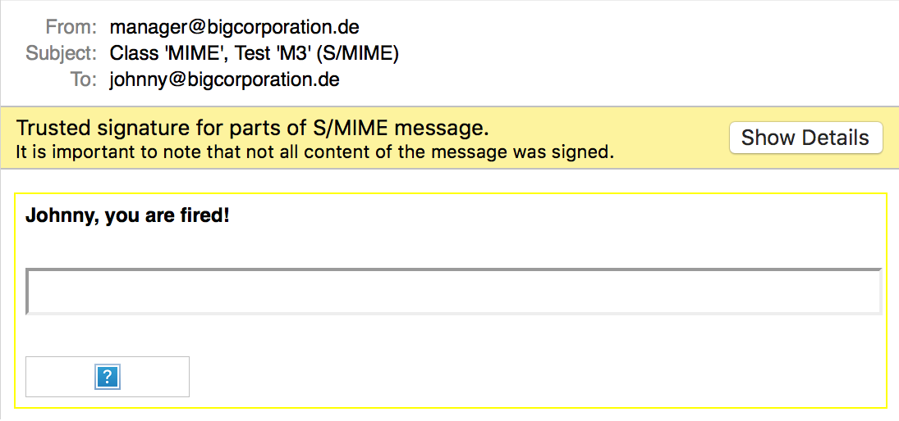

# Johnny-You-Are-Fired
Artifacts for the USENIX publication.

- [MailMate](#mailmate)
  * [CMS Attack Class](#cms-attack-class)
  * [MIME Attack Class](#mime-attack-class)
- [UI Attack Class](#ui-attack-class)

# MailMate

## CMS Attack Class

to be done...

## MIME Attack Class

### Test 'M1' (PGP)

### Test 'M1' (S/MIME)

### Test 'M2' (PGP)

### Test 'M2' (S/MIME)

### Test 'M3' (PGP)

### Test 'M3' (S/MIME)

# UI Attack Class

