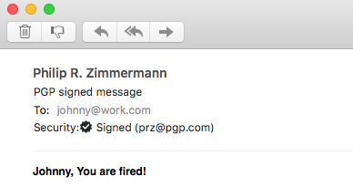

# Johnny-You-Are-Fired
Artifacts for the USENIX publication | Full paper [here](paper/johnny-fired.pdf)

### Abstract
OpenPGP and S/MIME are the two major standards to encrypt and digitally sign emails. Digital signatures are supposed to guarantee authenticity and integrity of messages. In this work we show practical forgery attacks against various implementations of OpenPGP and S/MIME email signature verification in five attack classes: (1) We analyze edge cases in S/MIME's container format. (2) We exploit in-band signaling in the GnuPG API, the most widely used OpenPGP implementation. (3) We apply MIME wrapping attacks that abuse the email clients' handling of partially signed messages. (4) We analyze weaknesses in the binding of signed messages to the sender identity. (5) We systematically test email clients for UI redressing attacks.

Our attacks allow the spoofing of digital signatures for arbitrary messages in 14 out of 20 tested OpenPGP-capable email clients and 15 out of 22 email clients supporting S/MIME signatures. While the attacks do not target the underlying cryptographic primitives of digital signatures, they raise concerns about the actual security of OpenPGP and S/MIME email applications. Finally, we propose mitigation strategies to counter these attacks.

### Attack classes

1. **CMS attacks.** Cryptographic Message Syntax (CMS) is a versatile standard for signed and encrypted messages within the X.509 public-key infrastructure. We found flaws in the handling of emails with contradicting or unusual data structures.

2. **GPG API attacks.** GnuPG is the most widely used OpenPGP implementation, but it only offers a very restricted command line interface for validating signatures. This interface was vulnerable to injection attacks.

3. **MIME attacks.** The body of an email is conceptually a MIME *tree*, but typically the tree has only one leaf which is signed. We construct non-standard MIME trees that trick clients into showing an unsigned text while verifying an unrelated signature in another part.

4. **ID attacks.** The goal of this attack class is to display a valid signature from the identity (ID) of a trusted communication partner located in the mail header, although the crafted email is actually signed by the attacker.

5. **UI attacks.** Email clients indicate a valid signature by showing some security indicators in the user interface (UI), for example, a letter with a seal. However, several clients allow the mimicking of important UI elements by using HTML, CSS, and other embedded content.

### Evaluation of OpenPGP-capable email clients

### Evaluation email clients supporting S/MIME

## Press

#### 2019/4/30

* **Bundesamt für Sicherheit in der Informationstechnik**: [*Forscher finden Schwachstellen in E-Mail-Signaturprüfung*](https://www.bsi.bund.de/DE/Presse/Pressemitteilungen/Presse2019/Signaturfaelschungen-300419.html)
* **golem.de**: [*Mailprogramme fallen auf falsche Signaturen herein*](https://www.golem.de/news/pgp-und-s-mime-mailprogramme-fallen-auf-falsche-signaturen-herein-1904-140939.html) (Hanno Böck)
